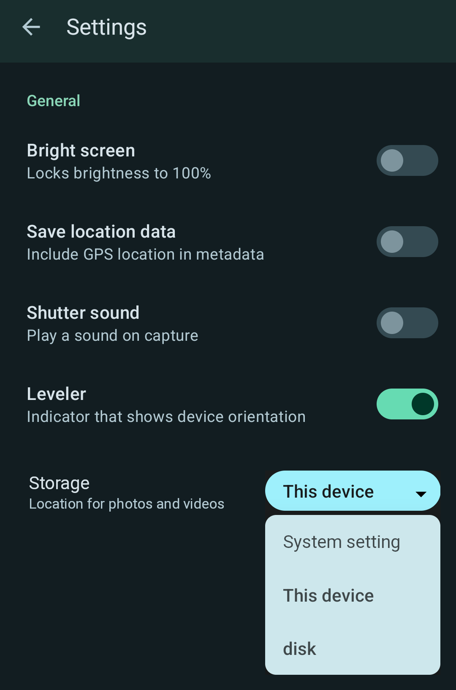

= Choose Internal or SD Card for Camera storage

When using Aperture (LineageOS' camera app) and an SD card is available, I want
in the settings of this app to select the storage device in order to maximize
the use of the total storage avaiable.

Criteria are:
- Only when an SD card is available an 1-of-n selection (ListPreference) is
shown in the settings of the camera app, just below the setting for Leveler.
- The title is "Storage" and the summary is  "Location for photos and videos".
- This selection shows "System setting", "This device" (for internal storage)
and "disk" (for SD card storage).
- The default value is the value of "System setting" and that uses the device
set in Storage menu in the system settings app.
- When the user changes the setting, that device id used for storage.
- When the SD card becomes unavailable, this setting will not appear in the
settings of the camera app and the internal storage "This device" is used.
- If the SD card becomes availabe again, the storage selection in settings will
reapprear, will be set to the previous chosen selection and will be used to for
storage.

Technical requirements:
- persistent saving of a enum or string for this setting
- hiding and showing of this coice in settings GUI
- calling methods from system app related to storage
- detecting if SD card is available
- path for storage on SD card is `/DCIM/Camera`

Files:
- Aperture settings GUI [app/src/main/res/xml/root_preferences.xml](app/src/main/res/xml/root_preferences.xml)
- Aperture texts [app/src/main/res/values/strings.xml](app/src/main/res/values/strings.xml)
- Aperture settings code [app/src/main/java/org/lineageos/aperture/SettingsActivity.kt](app/src/main/java/org/lineageos/aperture/SettingsActivity.kt)
- system settings app code https://github.com/LineageOS/android_packages_apps_Settings/blob/lineage-20.0/src/com/android/settings/deviceinfo/storage/StorageEntry.java#L45
- system settings app text and translatons for storage on "This device" can be reused from https://github.com/LineageOS/android_packages_apps_Settings/blob/lineage-20.0/res/values/strings.xml#L12502

See also:
- https://gitlab.com/LineageOS/issues/android/-/issues/5654
- https://developer.android.com/reference/kotlin/android/preference/ListPreference
- https://github.com/SimpleMobileTools/Simple-Commons/blob/master/commons/src/main/kotlin/com/simplemobiletools/commons/extensions/Context-storage.kt#L144
- https://github.com/SimpleMobileTools/Simple-File-Manager/blob/master/app/src/main/kotlin/com/simplemobiletools/filemanager/pro/helpers/Config.kt#L33
